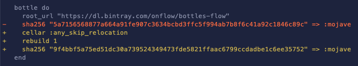

# Homebrew

Instructions for building and releasing the Flow CLI on Homebrew.

### Getting the tap

The Flow CLI formula lives in the `onflow/flow` tap repository: https://github.com/onflow/homebrew-flow. You'll need to have a local copy of this repository to update the CLI on Homebrew.

For this tutorial, please run the following command, which clones the repository to `/usr/local/Homebrew/Library/Taps/`:
```sh
brew tap onflow/flow
cd /usr/local/Homebrew/Library/Taps/onflow/homebrew-flow
```

### Updating the formula

Make any necessary changes to the Flow CLI formula located at `homebrew-flow/Formula/flow-cli.rb`.

If you are just updating to a new version, it's as simple as changing this line to point to the new tag (and the commit hash it is pinned to):

```rb
url "https://github.com/dapperlabs/flow-cli.git", :using => :git, :tag => "v0.1.0", :revision => "2a27b0565f03ddab70d49c421f20544da2463c5b"
```

**Don't push this change yet! We'll do that at the end.**

### Bottling the CLI

The Flow CLI uses prebuilt binaries (called [bottles](https://docs.brew.sh/Bottles)) for faster installation. New bottles need to be built and uploaded when the CLI is updated.

#### Bintray

Homebrew bottles are uploaded to [Bintray](https://bintray.com/). 

> ⚠️ If this is your first time updating the Flow CLI, you'll need to [sign up](https://bintray.com/signup/oss) and then contact @psiemens to be added to the [onflow](https://bintray.com/onflow) organization.

#### Building the bottles

The following command runs the installation process for the new Flow CLI formula and saves the resulting binary as a bottle.

It's best to run it from a temporary, empty directory:

```sh
mkdir flow-cli-bottles && cd flow-cli-bottles
```

```sh
brew test-bot \
    --root-url=https://dl.bintray.com/onflow/bottles-flow \
    --bintray-org=onflow \
    --tap=onflow/flow \
    onflow/flow/flow-cli
```

This should generate 3 files that look like this in the current directory:

```
flow-cli--0.1.0.mojave.bottle.tar.gz
flow-cli--0.1.0.mojave.bottle.json
steps_output.txt
```

#### Uploading the bottles

Before uploading the bottles to Bintray, you'll need to set the following environment variables:

```sh
export HOMEBREW_BINTRAY_USER=<your username>
export HOMEBREW_BINTRAY_KEY=<your API key> # found in Edit Profile -> API Key when logged in to Bintray
```

Then, in the folder contains the bottles and JSON files, run this:

```sh
# uninstall the CLI if you already have it
brew uninstall onflow/flow/flow-cli

brew test-bot \
    --ci-upload \
    --git-name=GIT_USERNAME \
    --git-email=GIT_EMAIL \
    --bintray-org=onflow \
    --root-url=https://dl.bintray.com/onflow/bottles-flow
```

#### Publishing the bottles

After the new bottles are uploaded, you'll need to go to [the repository page on Bintray](https://bintray.com/onflow/bottles-flow/flow-cli) and click "Publish".

### Verify that it works!

To check that the new bottle works as expected, re-install the CLI:

```sh
brew update onflow/flow/flow-cli
```

This should install the new version from the bottle you just uploaded.

```
==> Installing flow-cli from onflow/flow
==> Downloading https://dl.bintray.com/onflow/bottles-flow/flow-cli-0.1.0.mojave.bottle.tar.gz
Already downloaded: /Users/foo/Library/Caches/Homebrew/downloads/5c97a5af672378d6e50d07f2283332e689091c03801c375a92d31d2840a6e781--flow-cli-0.1.0.mojave.bottle.tar.gz
==> Pouring flow-cli-0.1.0.mojave.bottle.tar.gz
🍺  /usr/local/Cellar/flow-cli/0.1.0: 4 files, 41.0MB
```

### Pushing the formula update

Last but not least, create a new commit for the updated formula. 

If you run `git diff`, you should see that Homebrew automatically updated the `bottle` section of the formula:



```sh
git add Formula/flow-cli.rb
git commit -m "Update Flow CLI to version X.X.X"
git push -u origin master
```

